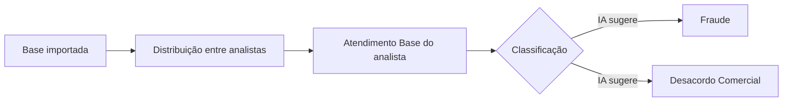

# Prevenção à Fraude — Tabulador de Atendimento

> Ferramenta de **prevenção à fraude** e tabulação de disputas para uma operação de **varejo de grande porte**, com **IA de classificação** e distribuição de casos entre analistas.


> ⚠️ Repositório de **estudo de caso**: descreve arquitetura, resultados e técnicas reais — sem código proprietário nem credenciais. Os trechos abaixo são **reescritos, ilustrativos**.

## Resultado de destaque 💰

> **R$ 200.000,00 em prejuízo com fraude evitado** graças à ferramenta de prevenção desenvolvida para a operação.

## O problema

Uma operação de varejo com alto volume de transações precisava **triar rapidamente** casos suspeitos, **distribuir a carga** entre analistas e padronizar o desfecho de cada atendimento (fraude × desacordo comercial) — reduzindo perdas e acelerando a resposta.

## Fluxo



## O que eu construí / evoluí

- **Distribuição de bases entre analistas** — vincular/desvincular casos a partir da lista de usuários liberados, com processamento otimizado no banco.
- **Atendimento Base** — fila dos casos pendentes de cada analista.
- **IA de classificação** — apoio à triagem de **Desacordo Comercial**, acelerando a decisão.
- **Integração com status de agentes (Genesys)** e **visibilidade de menu por perfil** (analista × admin).

## 🔧 Técnica em destaque (reescrita de forma ilustrativa)

**Distribuir N casos entre M analistas de uma vez, sem cursor.** O gargalo era vincular listas grandes; a chave foi fazer o _split_ da lista de analistas via XML e distribuir com `NTILE`/`ROW_NUMBER` em _set-based SQL_ (em vez de laço linha a linha):

```sql
-- @analistas = 'ana;bruno;carla'  (split por XML, robusto entre versões do SQL Server)
;WITH lista AS (
    SELECT LTRIM(RTRIM(x.value('.', 'VARCHAR(100)'))) AS analista,
           ROW_NUMBER() OVER (ORDER BY (SELECT 1)) AS r
    FROM (SELECT CAST('<i>' + REPLACE(@analistas, ';', '</i><i>') + '</i>' AS XML) AS n) t
    CROSS APPLY n.nodes('/i') AS y(x)
),
casos AS (
    SELECT id, NTILE((SELECT COUNT(*) FROM lista)) OVER (ORDER BY data_abertura) AS balde
    FROM casos_pendentes WHERE analista IS NULL
)
UPDATE c SET c.analista = l.analista
FROM casos_pendentes c
JOIN casos ca ON ca.id = c.id
JOIN lista l  ON l.r  = ca.balde;
```

## Stack

| Camada | Tecnologia |
|---|---|
| Back-end | C# · ASP.NET Core MVC |
| Banco | SQL Server · T-SQL · _stored procedures_ |
| Integrações | Genesys · IA de classificação |

## Impacto

Menos perda por fraude (**R$ 200 mil evitados**), triagem mais rápida e distribuição justa de carga entre a equipe.
